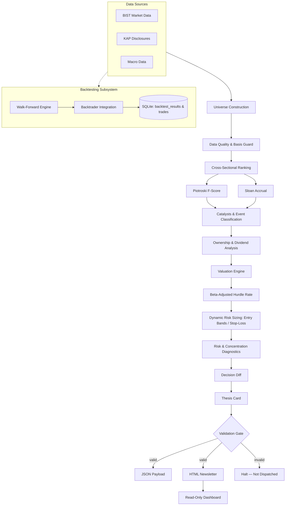
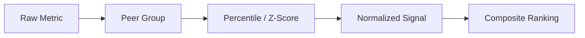
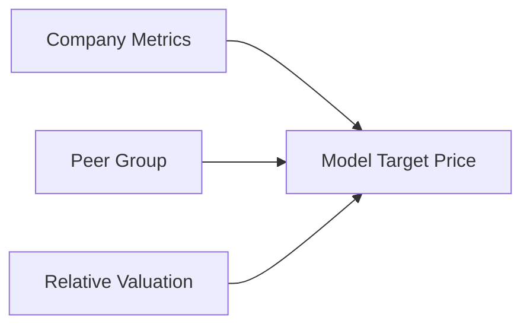
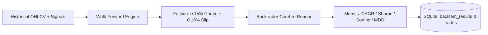
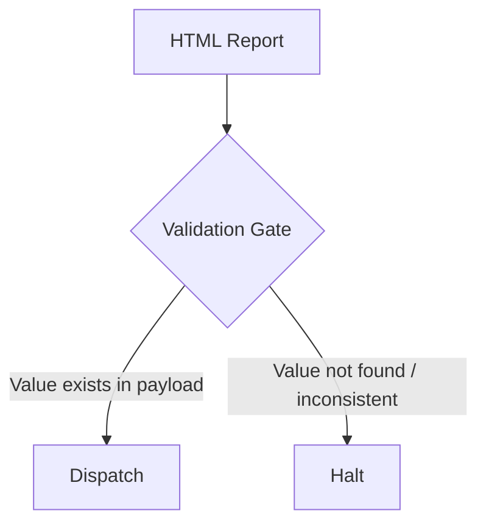
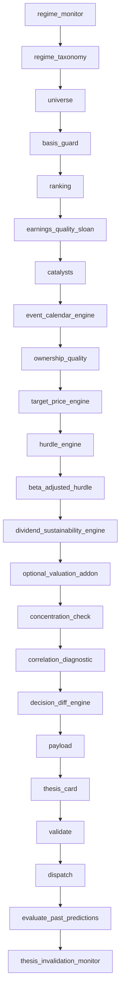
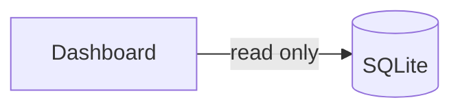

<div align="center">

# Autonomous BIST AI Screener

**A deterministic, data-driven, multi-factor equity screening and quantitative backtesting system for Borsa İstanbul.**


</div>

---

> **Disclaimer**
> This project is intended for research and decision-support purposes only. It does **not** constitute investment advice. Scores, rankings, target prices, and expected returns produced by the system are model outputs, not guarantees of future performance.

---

## Table of Contents

- [Overview](#overview)
- [Architecture](#architecture)
- [Analysis Layers](#analysis-layers)
  - [Market Regime](#market-regime)
  - [Universe Construction](#universe-construction)
  - [Cross-Sectional Ranking](#cross-sectional-ranking)
  - [Financial Quality](#financial-quality)
  - [Valuation](#valuation)
  - [Hurdle Rate](#hurdle-rate)
  - [Dynamic Risk Management & Position Sizing](#dynamic-risk-management--position-sizing)
  - [Catalysts & KAP](#catalysts--kap)
  - [Dividend Sustainability](#dividend-sustainability)
  - [Ownership Analysis](#ownership-analysis)
- [Data Quality Philosophy](#data-quality-philosophy)
- [Walk-Forward Backtesting Engine](#walk-forward-backtesting-engine)
- [Validation Gate](#validation-gate)
- [Execution Pipeline](#execution-pipeline)
- [Project Structure](#project-structure)
- [Installation](#installation)
- [Operating Modes](#operating-modes)
  - [Mock Mode](#mock-mode)
  - [Live Mode](#live-mode)
- [Running the Screener](#running-the-screener)
- [Running Backtests](#running-backtests)
- [Dashboard](#dashboard)
- [Automated Daily Execution](#automated-daily-execution)
- [MCP Servers](#mcp-servers)
- [Testing](#testing)
- [Reproducibility](#reproducibility)
- [Configuration](#configuration)
- [Known Limitations](#known-limitations)
- [Design Principles](#design-principles)
- [Roadmap](#roadmap)
- [Contributing](#contributing)
- [License](#license)

---

## Overview

`bist-screener` evaluates BIST-listed companies across multiple dimensions simultaneously — market regime, financial quality, valuation, catalysts, ownership structure, dividend sustainability, dynamic risk management, and expected return — rather than relying on any single metric.

The system runs as a daily pipeline and produces:

| Output | Description |
|---|---|
| HTML Newsletter | Clean stacked summary tables, WhatsApp-ready Quick-Copy snippet, and collapsible candidate thesis cards |
| JSON Payload | Structured, fully auditable machine-readable results |
| Streamlit Dashboard | Read-only interactive visualization layer |
| Backtesting Engine | Walk-forward simulation engine with Backtrader integration, tracking CAGR, Sharpe, Sortino, MDD, and trade logs in SQLite |

**Core commitments:**

- Deterministic calculations — same input, same output
- Explicit data provenance — model output is never disguised as external consensus
- Peer-relative analysis instead of universal fixed thresholds
- Conservative, explicit handling of missing data (no silent estimation)
- Strict separation between data acquisition and analytical logic
- Mandatory validation before any report is dispatched

---

## Architecture



---

## Analysis Layers

### Market Regime

A dedicated market-regime layer tracks prevailing macro and market conditions. This information provides **context** for the screening process and is used in reporting — it is deliberately **not** fed back into the core ranking score. This isolation between regime taxonomy and scoring is intentional and covered by dedicated tests.

### Universe Construction

In live mode, the BIST universe is built dynamically rather than from a hardcoded ticker list. Filtering criteria include:

- Minimum trading volume
- Minimum listing history
- Data quality and completeness
- Trading restrictions (tedbir / VBTS)
- Peer-group eligibility
- Reporting basis compatibility

### Cross-Sectional Ranking

Rather than applying fixed universal thresholds (e.g. *"P/E < 10 = attractive"*), the system ranks companies **within their peer group**:



This accounts for the fact that different sectors naturally carry different valuation multiples and financial characteristics.

### Financial Quality

**Piotroski F-Score** — a 9-criteria assessment covering profitability, cash flow, leverage, liquidity, and operational efficiency.

**Sloan Accrual** — measures the extent to which reported earnings are backed by actual cash generation, surfacing divergence between accounting earnings and cash flow.

### Valuation

The system does **not** source target prices from external analyst consensus. Instead, it computes its own peer-relative valuation:



The resulting figure is explicitly a **model-generated estimate**, not analyst consensus, not a broker target, and not a guarantee.

### Hurdle Rate

Expected return is never assessed in isolation — it is compared against a required-return benchmark built from:

- Risk-free rate / government bond yield
- Equity risk premium
- Beta
- Beta-adjusted hurdle rate

```
Expected Return   vs.   Required Return
```

### Dynamic Risk Management & Position Sizing

Signals do not rely on market orders (`entry_price = current_price`) or leave stop-losses null. Every candidate produces disciplined execution and risk parameters:

- **Stepped Entry Band (`entry_low`, `entry_high`)**:
  $$\text{entry\_low} = \text{current\_price} - 0.5 \times \text{ATR20}$$
  $$\text{entry\_high} = \text{current\_price} + 0.2 \times \text{ATR20}$$
  Accumulation is scaled 50% at the lower band and 50% at the upper band ($\text{effective\_entry} = 0.5 \times \text{entry\_low} + 0.5 \times \text{entry\_high}$).

- **Dynamic Stop-Loss (`stop_loss`)**:
  $$\text{stop\_loss} = \text{entry\_low} - 1.5 \times \text{ATR20}$$
  If a recent 20-day swing low provides an established support level below entry, the stop-loss dynamically anchors to $\min(\text{base\_stop}, \text{swing\_low})$ for robust protection.

- **Fixed Fractional Position Sizing (`position_size_pct`)**:
  Positions are sized inversely to risk distance per share, keeping account portfolio risk strictly within the target budget (1%–2%, default 1.5%):
  $$\text{position\_size\_pct} = \min\left(25.0\%,\, \frac{\text{account\_risk\_pct}}{\text{risk\_per\_share} \,/\, \text{effective\_entry}}\right)$$

### Catalysts & KAP

KAP (Public Disclosure Platform) filings are classified using a **rule-based / regex** approach — not an LLM-based prediction model. This choice prioritizes deterministic, reproducible, and transparent classification over probabilistic inference.

### Dividend Sustainability

Dividend distributions are evaluated for sustainability using available financial data, feeding into the broader company-quality assessment rather than acting as a standalone ranking signal.

### Ownership Analysis

An ownership-quality layer incorporates available shareholder-structure information where data permits. Missing ownership data is never treated as an implicit positive or negative signal.

---

## Data Quality Philosophy

> **Missing data is not positive data.**

When a value cannot be reliably sourced:

```python
if data_is_missing:
    value = None
```

...rather than being estimated or inferred. This is especially relevant for banks, insurers, and leasing companies, whose financial statement formats differ structurally and may cause certain metrics to be non-computable. Such companies can be flagged with `reporting_basis = "unknown"` and are automatically excluded by the relevant guard mechanisms.


---

## Walk-Forward Backtesting Engine

To bridge the gap between forward-looking prediction tracking and historical strategy validation, the system provides an event-driven **Walk-Forward Backtesting Engine** paired with **Backtrader** integration:

- **Zero Look-Ahead Bias**: Signals and dynamic risk bands are evaluated strictly on information available on or before each trading bar (`effective_at <= bar_date`).
- **Realistic Execution Friction**: Default trading costs incorporate institutional friction — **0.15% commission** + **0.10% slippage** per trade.
- **Institutional Metrics**: Calculates Compounded Annual Growth Rate (**CAGR**), **Sharpe Ratio** (annualized vs. risk-free rate), **Sortino Ratio** (downside deviation), **Max Drawdown (MDD)**, **Hit Rate (% profitable trades)**, and **Profit Factor**.
- **Full Traceability**: Every simulated trade, entry/exit timestamp, dynamic stop trigger, and trade return is persisted into SQLite tables (`backtest_results` and `backtest_trades`).



---

## Validation Gate

Every report passes through a validation stage before dispatch. Numerical values in the HTML report are cross-checked against the underlying JSON payload:



This prevents unsourced or inconsistent figures from ever being published.

---

## Execution Pipeline

`run.py` executes the analysis in a fixed, ordered sequence:



---

## Project Structure

```text
bist-screener-v9/
│
├── bist_mcp/                 # BIST data MCP server
├── kap_web_mcp/               # KAP data MCP server
├── macro_mcp/                 # Macro data MCP server
│
├── core/                      # Core deterministic calculation engines
│   ├── ranking.py
│   ├── scoring.py
│   ├── targets.py
│   ├── evaluate.py
│   └── ...
│
├── config/                    # Configuration and model assumptions
│
├── data/                      # SQLite database and generated reports
│   ├── bist_history.db
│   └── reports/
│
├── report/                    # HTML templates and validation logic
├── skills/                    # CLI / methodology packages
├── tests/                     # Automated test suite
│
├── dashboard.py                # Streamlit dashboard
├── run.py                      # Daily orchestrator
├── requirements.txt
├── .env.example
│
├── bist_screener_v9_prompt.json
├── bist_screener_v10_roadmap.json
└── README.md
```

---

## Installation

**1. Clone the repository**

```bash
git clone https://github.com/erenkbgc/bist-screener-v9.git
cd bist-screener-v9
```

**2. Create a virtual environment**

```bash
python3 -m venv .venv
source .venv/bin/activate      # Windows: .venv\Scripts\activate
```

**3. Install dependencies**

```bash
pip install -r requirements.txt
```

**4. Configure environment variables**

```bash
cp .env.example .env
```

Fill in the relevant variables in `.env` — including SMTP settings if you want reports delivered by email.

---

## Operating Modes

### Mock Mode

The default mode. Fully deterministic and safe for development.

```bash
BIST_DATA_MODE=mock
```

- Produces identical output for a given `as_of_date`
- Does **not** reflect real market conditions
- Ideal for local development, CI, and testing

### Live Mode

```bash
export BIST_DATA_MODE=live
python run.py --as-of-date 2026-09-10
```

The live data layer sources price, OHLCV, financial statements, dividends, and KAP headline data via `borsapy`. The BIST universe is constructed dynamically — there is no hardcoded ticker list.

> Depending on provider coverage, some fields may be unavailable. The system leaves these fields empty rather than fabricating values.

---

## Running the Screener

**Single run for a specific date:**

```bash
python run.py --as-of-date 2026-09-10
```

**Run using the current date:**

```bash
python run.py
```

---

## Running Backtests

Simulate historical strategy performance, friction costs, and dynamic risk execution across any BIST stock:

**Run walk-forward backtest via CLI:**

```bash
python -m core.backtest --ticker FORTE --days 250 --capital 100000
```

**Run using the Backtrader engine:**

```bash
python -m core.backtest --ticker FORTE --days 250 --backtrader
```

---

## Dashboard

```bash
streamlit run dashboard.py
```

The Streamlit dashboard is strictly **read-only** — it has no write access to the underlying database.



---

## Automated Daily Execution

Example `cron` entry:

```cron
30 18 * * * cd /path/to/bist-screener-v9 && .venv/bin/python run.py >> logs/run.log 2>&1
```

Default intended execution time: **18:30, Europe/Istanbul**.

---

## MCP Servers

The project includes three independent MCP data-access layers:

```text
bist_mcp/       BIST market data
kap_web_mcp/    KAP disclosures
macro_mcp/      Macroeconomic data
```

Each can be run independently, e.g.:

```bash
python -m bist_mcp.server
```

---

## Testing

```bash
pytest tests/ -v
```

The suite (162 tests) covers:

<details>
<summary>Test coverage areas</summary>

- Basis guard
- Hurdle engine
- Piotroski F-Score
- Sloan accrual cross-sectional calculations
- Beta-adjusted hurdle
- Event calendar
- Regime taxonomy isolation
- Invalidation monitor
- Validation gate
- Banned claims / unsupported statements
- Idempotency
- Dashboard read-only behavior
- Dynamic risk levels (ATR entry band, stop-loss, position sizing)
- Walk-forward backtesting engine & zero look-ahead bias
- Backtrader Cerebro runner & institutional performance metrics
- Backtest database persistence and trade audit logs

</details>

---

## Reproducibility

For a fixed dataset and configuration, the system guarantees:

```
Same Input  →  Same Calculation  →  Same Output
```

Strategy performance is verified through rigorous walk-forward backtesting with transaction costs and slippage, and forward thesis outcomes are monitored in parallel via prediction tracking.

---

## Configuration

Model assumptions live outside the calculation layer, e.g.:

```text
config/weights.yaml
config/equity_risk_premium.yaml
```

These are **starting assumptions**, not empirically validated optimal parameters — changing them can materially change screening results.

---

## Known Limitations

| Area | Status |
|---|---|
| Broker concentration guard | In development (v13 P1) |
| XU100 historical benchmark series | Integration incomplete |
| Investor count / retail-institutional split | No reliable free data source |
| TCMB expectation data | Partially unavailable |
| Tedbir / VBTS data (live mode) | May be incomplete |
| GYO / holding NAV calculation | In development (v13 P0 Multi-Factor Valuation) |
| Bank & insurance sector ratios | Some sector-specific ratios not computable |
| Listing-day, volume, KAP classification | Some fields rely on proxy assumptions |

These gaps are represented explicitly as `None` / `unknown` rather than being silently filled in.

---

## Design Principles

1. **Deterministic calculation** — same data always produces the same result.
2. **No fabrication for missing data** — absent a reliable source, the field is `None`.
3. **Avoid fixed thresholds** — peer-relative ranking is preferred over absolute cutoffs.
4. **No hidden assumptions** — weights and parameters in config files are documented starting assumptions, not proven constants.
5. **Backtest ≠ prediction tracking** — these are treated as distinct concepts.
6. **Read-only dashboard** — the visualization layer cannot alter underlying data.
7. **Validate before dispatch** — no report is sent without passing the validation gate.

---

## Roadmap

Active engineering is driving the **v13 Institutional Quality Upgrade**:

- **P0 Core Risk & Methodology**
  - [x] Dynamic Entry / Stop-Loss / Fixed Fractional Position Sizing
  - [x] Walk-Forward Backtesting Engine & Backtrader Integration
  - [ ] Multi-Factor Valuation Triangle (DCF + Peer Multiples + Quality Premium + GYO NAV)
  - [ ] Look-Ahead Bias & Survivorship Bias Guards
- **P1 Execution & Monitoring**
  - [ ] AKD / Broker Distribution Analysis & Net Buying Concentration
  - [ ] Trailing Stop-Loss & Dynamic Target Adjustments
  - [ ] Sector-Specific Financial Quality Templates (Banks, Tech, GYO, Industry)
  - [ ] KAP LLM/NLP Sentiment & Financial Catalyst Classification
- **P2 Scalability & Distribution**
  - [ ] Telegram Bot Integration for Real-Time Signals & Invalidation Alerts
  - [ ] Multi-User Portfolio Watchlists & Dynamic Position Alerts
  - [ ] Black-Litterman & Risk Parity Portfolio Optimization
- **P3 Microstructure & Infrastructure**
  - [ ] Order Book Imbalance / Depth Metrics
  - [ ] Parallel Scraping & Distributed Data Pipeline
  - [ ] Vectorized Feature Store (Parquet/DuckDB)

Detailed roadmap document: [`TODO.md`](./TODO.md)

---

## Disclaimer

This project is developed for educational, research, and personal decision-support purposes.

None of the following should be interpreted as investment advice, a buy/sell recommendation, or a guarantee of future performance:

- Scores
- Rankings
- Target prices
- Expected returns
- Financial metrics
- Analyses

Past performance in financial markets does not guarantee future results. Investment decisions should be made based on independent research and, where appropriate, professional financial advice.

---

## Contributing

This repository is developed primarily for personal use, but contributions are welcome via GitHub Issues and Pull Requests:

- Bug reports
- Feature requests
- Data source suggestions
- Architectural improvements
- Test contributions

---

## License

See the repository for applicable license information.

---

<div align="center">

**Autonomous BIST AI Screener — v9**

Data · Fundamentals · Relative Ranking · Risk · Valuation · Catalysts · Validation → Research Output

[Repository](https://github.com/erenkbgc/bist-screener-v9)

</div>
