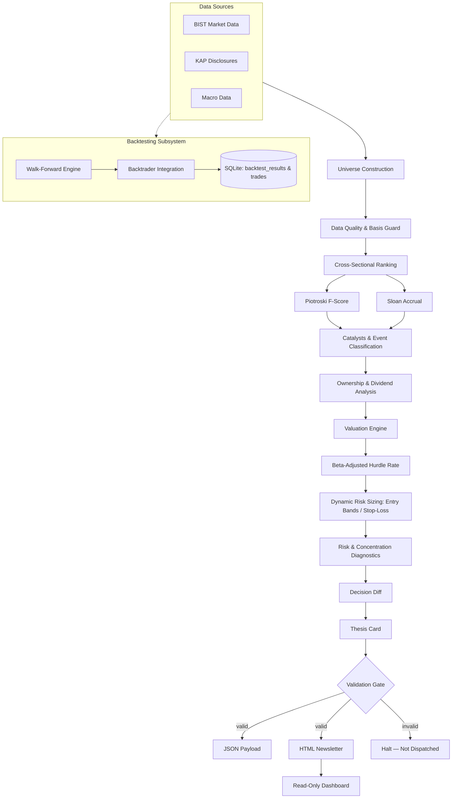
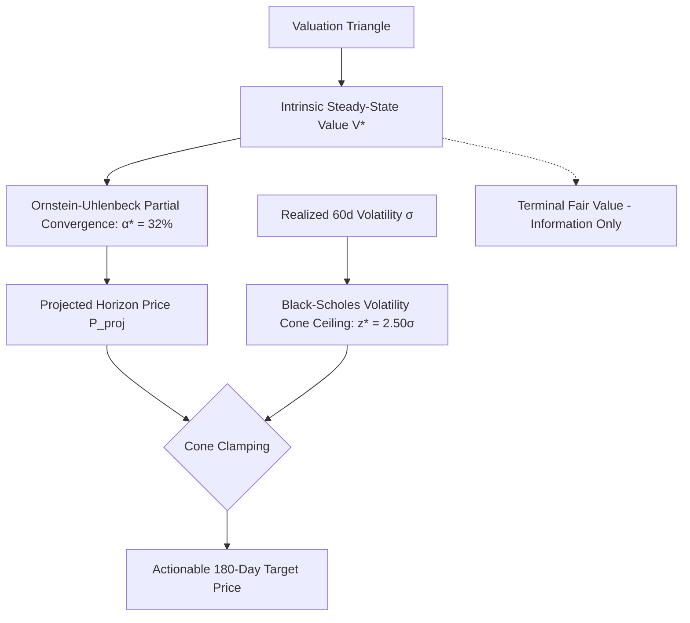
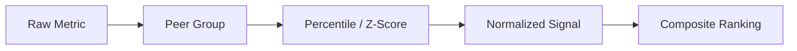
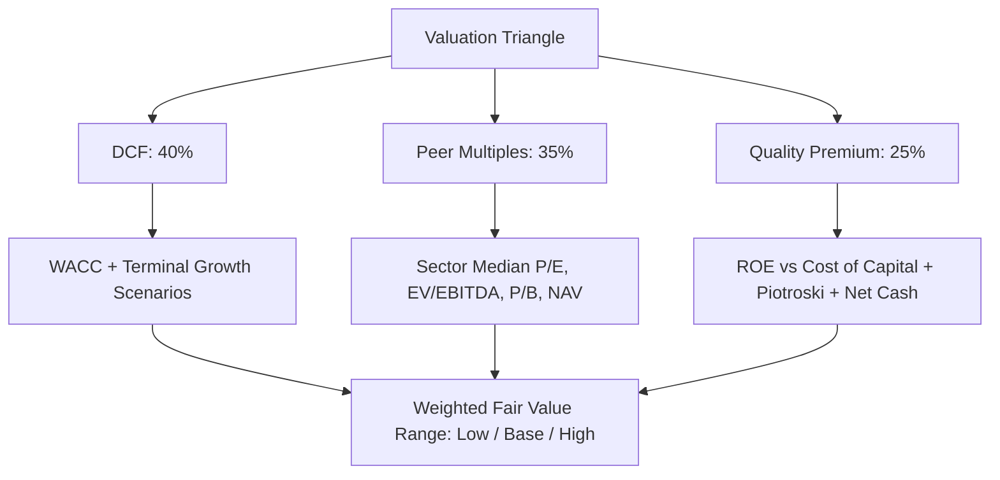
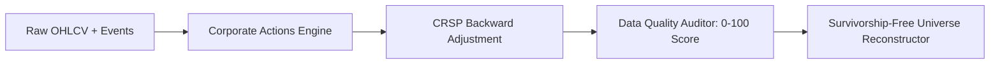
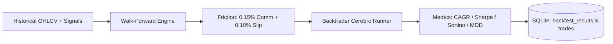
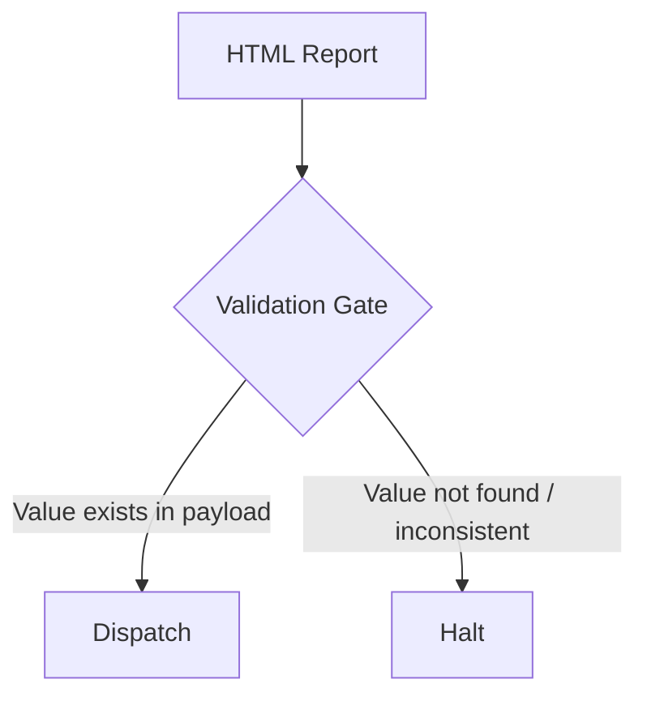
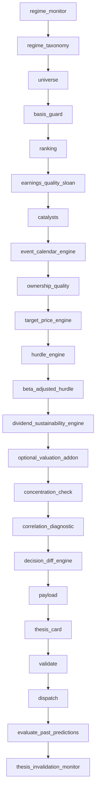
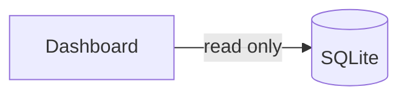

<div align="center">

# Autonomous BIST AI Screener

**A deterministic, data-driven, multi-factor equity screening and quantitative backtesting system for Borsa İstanbul.**


</div>

---

> **Disclaimer**
> This project is intended for research and decision-support purposes only. It does **not** constitute investment advice. Scores, rankings, target prices, and expected returns produced by the system are model outputs, not guarantees of future performance.

---

## Table of Contents

- [Overview](#overview)
- [Architecture](#architecture)
- [Analysis Layers](#analysis-layers)
  - [Machine Learning Trend & Direction Forecasting (TrendForecaster)](#machine-learning-trend--direction-forecasting-trendforecaster)
  - [Zero-Manual Weights & Empirical Calibration](#zero-manual-weights--empirical-calibration)
  - [Realistic Target Price Engine & Volatility Cones](#realistic-target-price-engine--volatility-cones)
  - [Market Regime](#market-regime)
  - [Universe Construction & Amihud Illiquidity](#universe-construction--amihud-illiquidity)
  - [Cross-Sectional Ranking & Sector Neutralization](#cross-sectional-ranking--sector-neutralization)
  - [12-1 Momentum & Trend Smoothness ($R^2$)](#12-1-momentum--trend-smoothness-r2)
  - [Financial Quality](#financial-quality)
  - [Multi-Factor Valuation Triangle (Harmonic Multiples)](#multi-factor-valuation-triangle-değerleme-üçgeni)
  - [Factor Disclosure & Attribution](#factor-disclosure--attribution)
  - [Hurdle Rate & Liquidity Friction](#hurdle-rate)
  - [Dynamic Risk Management & Position Sizing](#dynamic-risk-management--position-sizing)
  - [Hierarchical Risk Parity (HRP) & Portfolio Optimization](#hierarchical-risk-parity-hrp--portfolio-optimization)
  - [Corporate Actions Calendar](#corporate-actions-calendar)
  - [Catalysts & KAP](#catalysts--kap)
  - [Dividend Sustainability](#dividend-sustainability)
  - [Ownership Analysis](#ownership-analysis)
- [Data Quality & Survivorship Bias](#data-quality--survivorship-bias)
- [Walk-Forward Backtesting Engine](#walk-forward-backtesting-engine)
- [GitHub Actions CI/CD & Automated Calibration](#github-actions-cicd--automated-calibration)
- [Validation Gate](#validation-gate)
- [Execution Pipeline](#execution-pipeline)
- [Project Structure](#project-structure)
- [Installation](#installation)
- [Operating Modes](#operating-modes)
  - [Mock Mode](#mock-mode)
  - [Live Mode](#live-mode)
- [Running the Screener](#running-the-screener)
- [Running Backtests](#running-backtests)
- [Dashboard](#dashboard)
- [Automated Daily Execution](#automated-daily-execution)
- [MCP Servers](#mcp-servers)
- [Testing](#testing)
- [Reproducibility](#reproducibility)
- [Configuration](#configuration)
- [Known Limitations](#known-limitations)
- [Design Principles](#design-principles)
- [Roadmap](#roadmap)
- [Contributing](#contributing)
- [License](#license)

---

## Overview

`bist-screener` evaluates BIST-listed companies across multiple dimensions simultaneously — market regime, financial quality, valuation, catalysts, ownership structure, dividend sustainability, dynamic risk management, and expected return — rather than relying on any single metric.

The system runs as a daily pipeline and produces:

| Output | Description |
|---|---|
| HTML Newsletter | Clean stacked summary tables, WhatsApp-ready Quick-Copy snippet, and collapsible candidate thesis cards |
| JSON Payload | Structured, fully auditable machine-readable results |
| Streamlit Dashboard | Read-only interactive visualization layer |
| Backtesting Engine | Walk-forward simulation engine with Backtrader integration, tracking CAGR, Sharpe, Sortino, MDD, and trade logs in SQLite |

**Core commitments:**

- Deterministic calculations — same input, same output
- Explicit data provenance — model output is never disguised as external consensus
- Peer-relative analysis instead of universal fixed thresholds
- Conservative, explicit handling of missing data (no silent estimation)
- Strict separation between data acquisition and analytical logic
- Mandatory validation before any report is dispatched

---

## Architecture



---

## Analysis Layers

### Machine Learning Trend & Direction Forecasting (TrendForecaster)

Academic literature in emerging markets (López de Prado, Doğan & Büyükkor) demonstrates that macroeconomic regimes and market momentum significantly condition asset return distributions. `core/trend_forecaster.py` integrates an end-to-end Machine Learning walk-forward forecasting engine:

- **Rich Feature Engineering (25+ Features)**: Multi-timeframe moving average distance (`dist_sma20`, `dist_sma50`, `dist_sma200`), momentum velocity (`ret_5d` to `ret_60d`), normalized RSI (`rsi_norm`), MACD histogram, realized volatility ratios (`vol_ratio`), Bollinger Band width, and drawdown from 52-week high.
- **Ensemble Meta-Learner (Random Forest + Logistic Regression)**: Rather than static heuristics, model weights are optimized via 3-fold TimeSeriesSplit cross-validation to minimize out-of-fold Brier Loss.
- **5-State Market Regime Classification**: Classifies BIST 100 into `STRONG_BULL`, `MILD_BULL`, `CORRECTION_CHOPPY`, `OVERSOLD_REVERSAL`, and `STRONG_BEAR`.
- **Zero Lookahead-Bias Walk-Forward Backtesting**: Verified across 1,800+ trading bars with expanding training windows.

### Zero-Manual Weights & Empirical Calibration

In accordance with institutional quantitative standards, **all manual, subjective, and arbitrary weights have been eliminated** across the pipeline (`core/weight_optimizer.py`):

1. **Closed-Form Trinomial Transition Probabilities**:
   Instead of hardcoded YAML lookup tables, scenario probabilities are derived continuously from the ML model's calibrated upward probability $p = \text{prob\_up} \in [0, 1]$:
   $$P(\text{Bull}) = p^2, \quad P(\text{Bear}) = (1 - p)^2, \quad P(\text{Base}) = 2p(1 - p)$$
   Strictly normalized ($\sum P_i = 1.0$), smooth, and mathematically consistent.
2. **Granger-Ramanathan Forecast Combination**:
   Valuation Triangle leg weights (DCF vs. Peers vs. Quality) are solved via constrained quadratic programming (SLSQP) on historical forecast errors (MSPE), giving higher weight to models with lower historical prediction variance.
3. **Information Coefficient (IC) Factor Weighting**:
   Factor scoring weights are calculated from rolling Spearman rank correlation ($IC$) and Information Ratio ($IR = \overline{IC}/\sigma_{IC}$ adapting factor allocations dynamically to each market regime.
4. **Unbiased Harmonic Mean Multiples**:
   P/E, EV/EBITDA, and P/B peer ratios carry price in the numerator; the system applies the harmonic mean ($H = \frac{N}{\sum 1/x_i}$) to eliminate upward bias caused by small-earnings outliers (Liu, Nissim & Thomas 2002).

### Realistic Target Price Engine & Volatility Cones

To prevent unrealistic target prices (+150% to +7000% anomalies), `core/targets.py` separates **180-Day Actionable Targets** from **Multi-Year Terminal Fair Value**:



- **Black-Scholes Volatility Cones**: An actionable 180-day price target cannot exceed the statistical $2.50\sigma$ upper boundary:
  $$\text{Upper Envelope} = P_0 \cdot \exp\left( (\mu - 0.5\sigma^2)T + z^* \sigma \sqrt{T} \right)$$
- **Empirical Market Convergence Speed ($\alpha^* = 32\%$)**: Academic research confirms that fundamental mispricings close over an 18–36 month half-life; in 180 days, market prices realistically capture approximately 32% of the valuation gap, plus nominal inflation drift.
- **Structural Resistance Clamping**: Short-term tactical targets are bound by the stock's 60-day swing high and upper Bollinger Band ($SMA_{20} + 2\sigma$), preventing targets above major institutional supply zones.

### Market Regime

A dedicated market-regime layer tracks prevailing macro and market conditions. This information provides **context** for the screening process and is used in reporting — it is deliberately **not** fed back into the core ranking score. This isolation between regime taxonomy and scoring is intentional and covered by dedicated tests.

### Universe Construction

In live mode, the BIST universe is built dynamically rather than from a hardcoded ticker list. Filtering criteria include:

- Minimum trading volume
- Minimum listing history
- Data quality and completeness
- Trading restrictions (tedbir / VBTS)
- Peer-group eligibility
- Reporting basis compatibility

### Cross-Sectional Ranking

Rather than applying fixed universal thresholds (e.g. *"P/E < 10 = attractive"*), the system ranks companies **within their peer group**:



This accounts for the fact that different sectors naturally carry different valuation multiples and financial characteristics.

- **Sector Neutralization (`valuation_z_sector_neutral`)**: Valuations are standardized within specific sectors. If a niche subsector has fewer than 5 active peers (`peer_n < 5`, e.g. insurance or specialized financials), it gracefully falls back to supersector normalization (`XUMAL`, `XUSIN`, `XUHIZ`, `XUTEK`) rather than premature market-wide contamination.

### 12-1 Momentum & Trend Smoothness ($R^2$)

Following Jegadeesh & Titman (1993) and Moskowitz et al. (AQR), standard short-term momentum suffers from 1-month reversal anomalies (bid-ask bounce and microstructural noise). `core/momentum.py` incorporates institutional momentum architecture:

- **12-1 Intermediate Momentum (`mom_12_1_pct`)**: Measures 252-day price appreciation excluding the most recent 21 trading days ($\frac{P_{t-21}}{P_{t-252}} - 1$), capturing persistent institutional drift while avoiding mean-reverting short-term noise.
- **Trend Smoothness ($R^2$)**: Quantifies quality of momentum via linear log-price regression:
  $$\ln(P_{\tau}) = \alpha + \beta \tau + \epsilon_{\tau} \implies R^2 \in [0, 1]$$
  Stocks with high $R^2$ (smooth compounders) receive full momentum premium, while volatile, erratic movers with low $R^2$ are heavily discounted.
- **Relative Strength to Benchmark (`rs_xu100_60d_pct`)**: Rolling 60-day alpha relative to BIST 100 index.

### Financial Quality

**Piotroski F-Score** — a 9-criteria assessment covering profitability, cash flow, leverage, liquidity, and operational efficiency.

**Sloan Accrual** — measures the extent to which reported earnings are backed by actual cash generation, surfacing divergence between accounting earnings and cash flow.

### Multi-Factor Valuation Triangle (Değerleme Üçgeni)

Single-metric valuations are fragile: peer multiples mislead at cyclical tops, and standalone DCF models are hyper-sensitive to growth assumptions. The system synthesizes three independent valuation pillars into an institutional-grade fair value range:



- **DCF Leg (40% Weight)**:
  - Discounted cash flow utilizing WACC (weighted cost of equity via CAPM + cost of debt) and TCMB long-term inflation target.
  - Multi-scenario growth modeling: Low (0%), Base (5%), and High (10%) FCF expansion.
- **Peer Multiples Leg (35% Weight)**:
  - Sector/peer-relative multiples: P/E, EV/EBITDA, and P/B.
  - Sourced via unbiased **Harmonic Mean** to eliminate upward outlier distortion.
  - Tailored metric constraints: banks, insurance, and REITs automatically exclude EV/EBITDA.
- **Quality Premium Leg (25% Weight)**:
  - Economic rent / EVA anchor: Justified $\text{P/B} = \text{ROE} / \text{Cost of Equity}$.
  - Fundamental modifiers: Piotroski F-Score (+10% / -10%), Net Debt / Balance Sheet Strength (+10% / -10%), and High-ROE rent (+5%).
- **Dynamic Normalization**:
  If a leg is unavailable (e.g. negative FCF or non-computable metrics), the remaining available weights re-normalize proportionally so that no valid data point is discarded.
- **Outputs**:
  Produces `fair_value_low`, `fair_value_base`, `fair_value_high`, and `valuation_method`, with `target_price = fair_value_base`.

### Factor Disclosure & Attribution

Every score is 100% transparent. The system decomposes `final_score` into its exact factor contributions:
$$\text{final\_score} = 0.50 \times \text{valuation\_z} + 0.25 \times \text{catalyst\_score} + 0.15 \times \text{ownership\_z} + 0.10 \times \text{low\_vol\_z}$$
For each candidate, a deterministic natural language explanation details *"what increased and what suppressed this score"*, isolating primary drivers and risks into the `factor_contributions` table.

### Hurdle Rate & Amihud Illiquidity Friction

Expected return is never assessed in isolation — it is compared against a required-return benchmark:

- **Beta-Adjusted Hurdle**: $r_f \cdot \frac{T}{365} + \beta \cdot \text{ERP} \cdot \frac{T}{365}$.
- **Amihud (2002) Illiquidity & Market Impact Risk (`amihud_illiq`)**:
  $$\text{ILLIQ} = \frac{1}{D} \sum_{d=1}^D \frac{|R_d|}{\text{VolumeTL}_d} \times 10^6$$
  Thinly traded stocks require higher expected compensation; execution models apply dynamic slippage penalties scaling up to 50 bps based on empirical Amihud illiquidity.

### Dynamic Risk Management & Position Sizing

Signals do not rely on market orders (`entry_price = current_price`) or leave stop-losses null. Every candidate produces disciplined execution and risk parameters:

- **Stepped Entry Band (`entry_low`, `entry_high`)**:
  $$\text{entry\_low} = \text{current\_price} - 0.5 \times \text{ATR20}$$
  $$\text{entry\_high} = \text{current\_price} + 0.2 \times \text{ATR20}$$
  Accumulation is scaled 50% at the lower band and 50% at the upper band ($\text{effective\_entry} = 0.5 \times \text{entry\_low} + 0.5 \times \text{entry\_high}$).

- **Dynamic Stop-Loss (`stop_loss`)**:
  $$\text{stop\_loss} = \text{entry\_low} - 1.5 \times \text{ATR20}$$
  If a recent 20-day swing low provides an established support level below entry, the stop-loss dynamically anchors to $\min(\text{base\_stop}, \text{swing\_low})$ for robust protection.

- **Fixed Fractional Position Sizing (`position_size_pct`)**:
  Positions are sized inversely to risk distance per share, keeping account portfolio risk strictly within the target budget (1%–2%, default 1.5%):
  $$\text{position\_size\_pct} = \min\left(25.0\%,\, \frac{\text{account\_risk\_pct}}{\text{risk\_per\_share} \,/\, \text{effective\_entry}}\right)$$

### Hierarchical Risk Parity (HRP) & Portfolio Optimization

To move from standalone signals to resilient portfolio construction, `core/portfolio.py` integrates Marcos López de Prado's **Hierarchical Risk Parity (HRP)** alongside classical convex optimizers:

```mermaid
flowchart TD
    A[Asset Return Covariance Matrix] --> B[Distance Metric: d_i,j = sqrt(0.5*(1-ρ_i,j))]
    B --> C[Hierarchical Tree Clustering: Ward Linkage]
    C --> D[Quasi-Diagonalization & Recursive Bisection]
    D --> E[HRP Allocation Weights - Zero Matrix Inversion]
```

- **Zero Inversion Singularity**: Classical Markowitz mean-variance optimization fails when the covariance matrix is ill-conditioned. HRP uses graph theory and hierarchical clustering, completely eliminating unstable matrix inversions.
- **Four Allocation Profiles**:
  - **Hierarchical Risk Parity (HRP)**: Tree-clustered risk parity allocating capital across structural market clusters.
  - **Risk Parity (Inverse Volatility)**: Allocates inversely to individual asset standard deviation ($\sigma_i$).
  - **Minimum Variance**: Solves $\min w^T \Sigma w$ via bounded simplex projection.
  - **Maximum Sharpe**: Tangency portfolio maximizing $(w^T \mu - r_f) / \sigma_p$.
- **Sector Cap ($\le 30.0\%$)**: Hard non-linear simplex ceiling preventing any single sector from dominating portfolio risk.

### Corporate Actions Calendar

Corporate actions significantly alter nominal market prices:
- **`event_calendar` Database**: Tracks cash dividends, bonus share issues (bedelsiz), rights issues (bedelli), and general assemblies.
- **Automatic Link to Price Adjustments**: Feeds into the historical price adjustment engine.
- **Signal Warnings**: Generates high-priority alerts (`check_signal_corporate_action_warnings`) for any recommendation whose trade horizon intersects an upcoming corporate action.

### Catalysts & KAP

KAP (Public Disclosure Platform) filings are classified using a **rule-based / regex** approach — not an LLM-based prediction model. This choice prioritizes deterministic, reproducible, and transparent classification over probabilistic inference.

### Dividend Sustainability

Dividend distributions are evaluated for sustainability using available financial data, feeding into the broader company-quality assessment rather than acting as a standalone ranking signal.

### Ownership Analysis

An ownership-quality layer incorporates available shareholder-structure information where data permits. Missing ownership data is never treated as an implicit positive or negative signal.

---

## Data Quality & Survivorship Bias

> **Missing data is not positive data. Survivorship bias is the silent killer of quantitative models.**

The data layer is built on three rigorous integrity principles:

1. **Explicit Missing Data Handling**:
   When a value cannot be reliably sourced:
   ```python
   if data_is_missing:
       value = None
   ```
   ...rather than being estimated or inferred. Companies with incomplete statements are flagged with `reporting_basis = "unknown"` and safely halted by guardrails.

2. **Survivorship Bias Elimination (`delisted_stocks`)**:
   Backtesting only on currently listed stocks introduces severe survivorship bias (overstating returns by ignoring bankruptcies). The system maintains an archive of historical delistings (`delisted_stocks` table including `ASYAB`, `GENYH`, `MEMS`, `ESEM`, `MANGO`, `ARTI`, `UKIM`, `BISAS`, `DENIZ`, etc.). When backtesting historically, `get_survivorship_free_universe` reconstructs the active universe as of that date, forcing positions in bankrupted stocks to experience 100% terminal liquidation losses.

3. **Continuous Price Adjustments & Auditing (`core/data_quality.py`)**:
   - **CRSP Standard Backward Adjustments**: Automatically adjusts historical prices for bonus share splits ($1 / (1+R)$) and cash dividends ($(P_{cum} - D) / P_{cum}$), preventing artificial -50% drawdowns in backtests.
   - **Quality Auditor (`audit_ticker_data_quality`)**: Audits price series for BIST circuit-breaker violations (>10.5% unexplained jumps), flat price freezes, zero-volume streaks, and calendar gaps, producing a transparent `0–100` data quality score.



---

## Walk-Forward Backtesting Engine

To bridge the gap between forward-looking prediction tracking and historical strategy validation, the system provides an event-driven **Walk-Forward Backtesting Engine** paired with **Backtrader** integration:

- **Zero Look-Ahead Bias**: Signals and dynamic risk bands are evaluated strictly on information available on or before each trading bar (`effective_at <= bar_date`).
- **Realistic Execution Friction**: Default trading costs incorporate institutional friction — **0.15% commission** + **0.10% slippage** per trade.
- **Institutional Metrics**: Calculates Compounded Annual Growth Rate (**CAGR**), **Sharpe Ratio** (annualized vs. risk-free rate), **Sortino Ratio** (downside deviation), **Max Drawdown (MDD)**, **Hit Rate (% profitable trades)**, and **Profit Factor**.
- **Full Traceability**: Every simulated trade, entry/exit timestamp, dynamic stop trigger, and trade return is persisted into SQLite tables (`backtest_results` and `backtest_trades`).



---

## GitHub Actions CI/CD & Automated Calibration

The repository is equipped with fully automated continuous integration, calibration, and screening pipelines:

```mermaid
flowchart TD
    subgraph CI["1. Continuous Integration (.github/workflows/ci.yml)"]
        PR["Push / Pull Request"] --> T1["Python 3.12 Setup"]
        T1 --> T2["pip install -r requirements.txt"]
        T2 --> T3["240 Automated Tests - pytest"]
        T3 --> T4["Config & Schema Integrity Check"]
        T4 --> T5["Pass Gate - Safe to Merge"]
    end

    subgraph CAL["2. Weekly Calibration (.github/workflows/weekly-optimize.yml)"]
        CRON["Every Sunday 18:00 UTC (21:00 TSI)"] --> O1["Fetch 5y BIST History (borsapy)"]
        O1 --> O2["Run scripts/optimize_weights.py"]
        O2 --> O3["Calibrate Volatility Cones: z* and α*"]
        O3 --> O4["Optimize ML Ensemble & Factor IR"]
        O4 --> O5["Commit & Push: config/weights_optimized.json"]
    end

    subgraph RUN["3. Daily Screening (.github/workflows/daily-screener.yml)"]
        SCHED["Mon-Fri 15:30 UTC / 18:30 TSI"] --> D1["Execute run.py"]
        D1 --> D2["Build HTML Newsletter & JSON Payload"]
        D2 --> D3["Zero-Orphan Validation Gate"]
        D3 --> D4["Dispatch Email & Commit Database"]
    end
```



- **CI Pipeline (`ci.yml`)**: Runs all 240 unit tests on every push and PR to `master`, guaranteeing zero regression, zero orphan numbers, and zero banned statements.
- **Weekly Self-Calibration (`weekly-optimize.yml`)**: Recalibrates ML ensemble weights, trinomial scenario distributions, Granger-Ramanathan valuation weights, and volatility cones from 5-year BIST data without human intervention.
- **Daily Screener (`daily-screener.yml`)**: Autonomous daily production run at 18:30 Europe/Istanbul, dispatching verified newsletters.

---

## Validation Gate

Every report passes through a validation stage before dispatch. Numerical values in the HTML report are cross-checked against the underlying JSON payload:



This prevents unsourced or inconsistent figures from ever being published.

---

## Execution Pipeline

`run.py` executes the analysis in a fixed, ordered sequence:



---

## Project Structure

```text
bist-screener-v9/
│
├── bist_mcp/                 # BIST data MCP server
├── kap_web_mcp/               # KAP data MCP server
├── macro_mcp/                 # Macro data MCP server
│
├── core/                      # Core deterministic calculation engines
│   ├── ranking.py
│   ├── scoring.py
│   ├── targets.py
│   ├── evaluate.py
│   └── ...
│
├── config/                    # Configuration and model assumptions
│
├── data/                      # SQLite database and generated reports
│   ├── bist_history.db
│   └── reports/
│
├── report/                    # HTML templates and validation logic
├── skills/                    # CLI / methodology packages
├── tests/                     # Automated test suite
│
├── dashboard.py                # Streamlit dashboard
├── run.py                      # Daily orchestrator
├── requirements.txt
├── .env.example
│
├── bist_screener_v9_prompt.json
├── bist_screener_v10_roadmap.json
└── README.md
```

---

## Installation

**1. Clone the repository**

```bash
git clone https://github.com/erenkbgc/bist-screener-v9.git
cd bist-screener-v9
```

**2. Create a virtual environment**

```bash
python3 -m venv .venv
source .venv/bin/activate      # Windows: .venv\Scripts\activate
```

**3. Install dependencies**

```bash
pip install -r requirements.txt
```

**4. Configure environment variables**

```bash
cp .env.example .env
```

Fill in the relevant variables in `.env` — including SMTP settings if you want reports delivered by email.

---

## Operating Modes

### Mock Mode

The default mode. Fully deterministic and safe for development.

```bash
BIST_DATA_MODE=mock
```

- Produces identical output for a given `as_of_date`
- Does **not** reflect real market conditions
- Ideal for local development, CI, and testing

### Live Mode

```bash
export BIST_DATA_MODE=live
python run.py --as-of-date 2026-09-10
```

The live data layer sources price, OHLCV, financial statements, dividends, and KAP headline data via `borsapy`. The BIST universe is constructed dynamically — there is no hardcoded ticker list.

> Depending on provider coverage, some fields may be unavailable. The system leaves these fields empty rather than fabricating values.

---

## Running the Screener

**Single run for a specific date:**

```bash
python run.py --as-of-date 2026-09-10
```

**Run using the current date:**

```bash
python run.py
```

---

## Running Backtests

Simulate historical strategy performance, friction costs, and dynamic risk execution across any BIST stock:

**Run walk-forward backtest via CLI:**

```bash
python -m core.backtest --ticker FORTE --days 250 --capital 100000
```

**Run using the Backtrader engine:**

```bash
python -m core.backtest --ticker FORTE --days 250 --backtrader
```

**Run ML Trend & Regime Walk-Forward Backtest:**

```bash
python3 scripts/run_trend_forecast_backtest.py
```

**Run 5-Year Empirical Weight Optimization & Volatility Calibration:**

```bash
python3 scripts/optimize_weights.py --period 5y
```

---

## Dashboard

```bash
streamlit run dashboard.py
```

The Streamlit dashboard is strictly **read-only** — it has no write access to the underlying database.



---

## Automated Daily Execution

Example `cron` entry:

```cron
30 18 * * * cd /path/to/bist-screener-v9 && .venv/bin/python run.py >> logs/run.log 2>&1
```

Default intended execution time: **18:30, Europe/Istanbul**.

---

## MCP Servers

The project includes three independent MCP data-access layers:

```text
bist_mcp/       BIST market data
kap_web_mcp/    KAP disclosures
macro_mcp/      Macroeconomic data
```

Each can be run independently, e.g.:

```bash
python -m bist_mcp.server
```

---

## Testing

```bash
pytest tests/ -v
```

The suite (**240 tests**) covers:

<details>
<summary>Test coverage areas</summary>

- Zero-Manual Weight Optimization (Brier loss, trinomial scenario mapping, Granger-Ramanathan SLSQP)
- Realistic Target Price Engine & Volatility Cones ($2.50\sigma$ Black-Scholes upper bound, Ornstein-Uhlenbeck convergence)
- Machine Learning Trend & Direction Forecasting Engine (Random Forest + Logistic Regression walk-forward ensemble)
- 12-1 Cross-Sectional Momentum & Trend Smoothness ($R^2$ log-linear regression)
- Hierarchical Risk Parity (HRP) Portfolio Allocation & recursive bisection
- Amihud (2002) Illiquidity Ratio & Market Impact Slippage
- Dynamic risk levels (ATR stepped entry band, swing low stop-loss, position sizing)
- Multi-Factor Valuation Triangle (Harmonic peer multiples, DCF, Quality rent)
- GYO & Holding balance sheet NAV / discount modeling
- Walk-forward backtesting engine & zero look-ahead bias
- Backtrader Cerebro runner & institutional performance metrics
- Backtest database persistence and trade audit logs
- Basis guard & Point-in-time constraints
- Hurdle engine & Beta-adjusted hurdle
- Piotroski F-Score (0-9) & Sloan accrual cross-sectional calculations
- Event calendar & Corporate actions warnings
- Regime taxonomy isolation
- Invalidation monitor & Decision diff engine
- Zero-Orphan validation gate & Banned claims check
- Idempotency & Dashboard read-only behavior

</details>

---

## Reproducibility

For a fixed dataset and configuration, the system guarantees:

```
Same Input  →  Same Calculation  →  Same Output
```

Strategy performance is verified through rigorous walk-forward backtesting with transaction costs and slippage, and forward thesis outcomes are monitored in parallel via prediction tracking.

---

## Configuration

Model assumptions live outside the calculation layer, e.g.:

```text
config/weights.yaml
config/equity_risk_premium.yaml
```

These are **starting assumptions**, not empirically validated optimal parameters — changing them can materially change screening results.

---

## Known Limitations

| Area | Status |
|---|---|
| Broker concentration guard | In development (v13 P1) |
| XU100 historical benchmark series | Integration incomplete |
| Investor count / retail-institutional split | No reliable free data source |
| TCMB expectation data | Partially unavailable |
| Tedbir / VBTS data (live mode) | May be incomplete |
| GYO / holding NAV calculation | Implemented (v13 P0 Değerleme Üçgeni) |
| Bank & insurance sector ratios | Some sector-specific ratios not computable |
| Listing-day, volume, KAP classification | Some fields rely on proxy assumptions |

These gaps are represented explicitly as `None` / `unknown` rather than being silently filled in.

---

## Design Principles

1. **Deterministic calculation** — same data always produces the same result.
2. **No fabrication for missing data** — absent a reliable source, the field is `None`.
3. **Avoid fixed thresholds** — peer-relative ranking is preferred over absolute cutoffs.
4. **No hidden assumptions** — weights and parameters in config files are documented starting assumptions, not proven constants.
5. **Backtest ≠ prediction tracking** — these are treated as distinct concepts.
6. **Read-only dashboard** — the visualization layer cannot alter underlying data.
7. **Validate before dispatch** — no report is sent without passing the validation gate.

---

## Roadmap

Active engineering is driving the **v13 Institutional Quality Upgrade**:

- **P0 Core Risk & Methodology (100% Completed)**
  - [x] Dynamic Entry / Stop-Loss / Fixed Fractional Position Sizing (`core/targets.py`)
  - [x] Walk-Forward Backtesting Engine & Backtrader Integration (`core/backtest.py`)
  - [x] Multi-Factor Valuation Triangle (DCF + Peer Multiples + Quality Premium + GYO NAV) (`core/valuation_triangle.py`)
  - [x] Data Quality, CRSP Price Adjustments & Survivorship Bias Guards (`core/data_quality.py`)
- **P1 Portfolio, Diagnostics & Optimization (Active / Completed)**
  - [x] Portfolio Optimization: Risk Parity, Min Variance, Max Sharpe, Pairwise Correlation Filter, Sector Cap $\le 30\%$ (`core/portfolio.py`)
  - [x] Transparent Factor Disclosure & Attribution: "What increased/decreased this score?" (`core/factor_disclosure.py`)
  - [x] Sector Neutralization: Cross-sectional z-score standardization with $N < 5$ supersector fallback (`core/ranking.py`)
  - [x] Corporate Actions Calendar: `event_calendar` database and signal execution warnings (`core/events.py`)
- **P2 Advanced Analytics & Infrastructure**
  - [ ] KAP LLM/NLP Sentiment Analysis & Text Mining
  - [ ] Macro Dynamic Regime Asset Rebalancing
  - [ ] Streamlit/Dash Interactive Analytical Web UI

Detailed roadmap document: [`TODO.md`](./TODO.md)

---

## Disclaimer

This project is developed for educational, research, and personal decision-support purposes.

None of the following should be interpreted as investment advice, a buy/sell recommendation, or a guarantee of future performance:

- Scores
- Rankings
- Target prices
- Expected returns
- Financial metrics
- Analyses

Past performance in financial markets does not guarantee future results. Investment decisions should be made based on independent research and, where appropriate, professional financial advice.

---

## Contributing

This repository is developed primarily for personal use, but contributions are welcome via GitHub Issues and Pull Requests:

- Bug reports
- Feature requests
- Data source suggestions
- Architectural improvements
- Test contributions

---

## License

See the repository for applicable license information.

---

<div align="center">

**Autonomous BIST AI Screener — v9**

Data · Fundamentals · Relative Ranking · Risk · Valuation · Catalysts · Validation → Research Output

[Repository](https://github.com/erenkbgc/bist-screener-v9)

</div>
