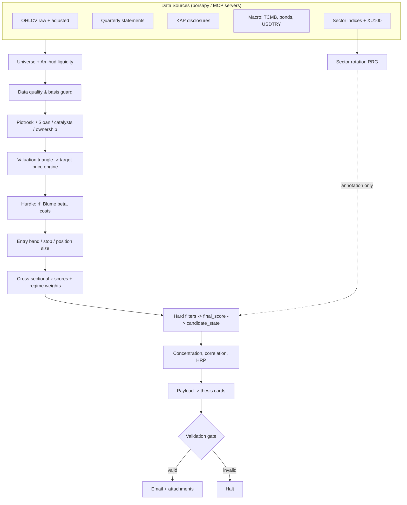
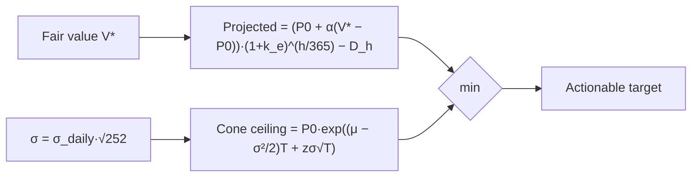
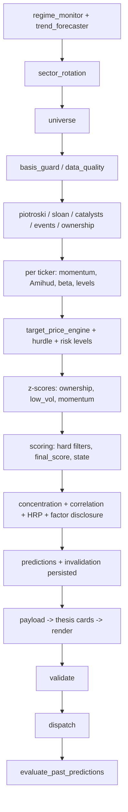

<div align="center">

# Autonomous BIST AI Screener

**A deterministic, multi-factor equity screening and research system for Borsa İstanbul.**


</div>

---

> **Disclaimer**
> This project is for research and decision support only. It does **not** constitute investment advice. Scores, rankings, target prices, and expected returns are model outputs, not guarantees of future performance.

> **Calibration status (2026-09-27)**
> The scoring weights in `config/weights.yaml` are **untested starting assumptions**. The stock-level factor model has not yet been backtested cross-sectionally; the point-in-time panel that makes this possible was added on 2026-09-27 (see [Research Infrastructure](#research-infrastructure)). The `outcomes` table (realised results of past predictions) is still too small for live attribution.

---

## Table of Contents

- [Overview](#overview)
- [Architecture](#architecture)
- [Analysis Layers](#analysis-layers)
  - [Price Data: Raw vs. Adjusted](#price-data-raw-vs-adjusted)
  - [Universe Construction & Amihud Illiquidity](#universe-construction--amihud-illiquidity)
  - [Cross-Sectional Ranking & Sector Neutralization](#cross-sectional-ranking--sector-neutralization)
  - [Scoring Model](#scoring-model)
  - [12-1 Momentum & Trend Smoothness](#12-1-momentum--trend-smoothness)
  - [Financial Quality](#financial-quality)
  - [Valuation Triangle](#valuation-triangle)
  - [Target Price Engine](#target-price-engine)
  - [Hurdle Rate, Beta & Transaction Costs](#hurdle-rate-beta--transaction-costs)
  - [Entry Band, Stop-Loss & Position Sizing](#entry-band-stop-loss--position-sizing)
  - [Support / Resistance & Volume Profile (Information Only)](#support--resistance--volume-profile-information-only)
  - [Sector Rotation (RRG)](#sector-rotation-rrg)
  - [ML Trend Forecaster & Market Regime](#ml-trend-forecaster--market-regime)
  - [Portfolio Construction (HRP)](#portfolio-construction-hrp)
  - [Catalysts, KAP & FinBERT Sentiment](#catalysts-kap--finbert-sentiment)
  - [Corporate Actions, Dividends & Ownership](#corporate-actions-dividends--ownership)
- [Research Infrastructure](#research-infrastructure)
- [Backtests & Evidence](#backtests--evidence)
- [Reports & Delivery](#reports--delivery)
- [Validation Gate](#validation-gate)
- [Execution Pipeline](#execution-pipeline)
- [GitHub Actions](#github-actions)
- [Project Structure](#project-structure)
- [Installation](#installation)
- [Operating Modes](#operating-modes)
- [Running](#running)
- [Testing](#testing)
- [Configuration](#configuration)
- [Known Limitations](#known-limitations)
- [Design Principles](#design-principles)
- [Roadmap](#roadmap)
- [License](#license)

---

## Overview

`bist-screener` evaluates BIST-listed companies on several dimensions at once: valuation, catalysts, ownership, volatility, momentum, financial quality, and expected return against a hurdle rate. It does not rely on any single metric.

The system runs as a daily pipeline and produces:

| Output | Description |
|---|---|
| Mobile email body | Single-column, inline-styled summary: candidate cards with target, entry band, stop, position size, support/resistance, sector quadrant |
| Detailed HTML report (attachment) | Full tables, thesis dossiers, methodology, WhatsApp-ready quick-copy block |
| Sector rotation Excel (attachment) | RRG summary, 5-week tail chart, data table, method sheet |
| JSON payload (attachment) | Every number shown in the reports, machine-readable and auditable |
| KAP sentiment JSON | FinBERT scores of recent disclosures for reported candidates |
| Streamlit dashboard | Read-only visualisation of the SQLite history |

**Core commitments:**

- Deterministic calculations: same input, same output.
- Missing data stays `None`; it is never estimated silently.
- Peer-relative ranking instead of universal fixed thresholds.
- Priors are disclosed as priors; evidence is reported with its t-statistic.
- No report is sent unless every number in it traces back to the payload.

---

## Architecture


```mermaid
flowchart TD
    subgraph SRC["Data Sources (borsapy / MCP servers)"]
        A1[OHLCV raw + adjusted]
        A2[Quarterly statements]
        A3[KAP disclosures]
        A4[Macro: TCMB, bonds, USDTRY]
        A5[Sector indices + XU100]
    end

    SRC --> B[Universe + Amihud liquidity]
    B --> C[Data quality & basis guard]
    C --> D[Piotroski / Sloan / catalysts / ownership]
    D --> E[Valuation triangle -> target price engine]
    E --> F[Hurdle: rf, Blume beta, costs]
    F --> G[Entry band / stop / position size]
    G --> H[Cross-sectional z-scores + regime weights]
    H --> I[Hard filters -> final_score -> candidate_state]
    I --> J[Concentration, correlation, HRP]
    A5 --> K[Sector rotation RRG]
    K -. annotation only .-> I
    J --> L[Payload -> thesis cards]
    L --> M{Validation gate}
    M -- valid --> N[Email + attachments]
    M -- invalid --> O[Halt]
```

---

## Analysis Layers

### Price Data: Raw vs. Adjusted

BIST companies issue bonus shares often (ASELS 2012/2016/2020/2023, AKFIS 500% in 2026). In the raw price series such an event looks like a −50% to −83% crash. `core/live_data.py::live_prices()` therefore returns two series:

| Field | Source | Used for |
|---|---|---|
| `close` | `borsapy` history, `adjust=False` | Price levels: market cap, P/E, entry, stop, target |
| `adj_close` | `borsapy` history, `adjust=True` | Every return: momentum, beta, correlation, covariance, volatility, Amihud |

SMA20/50 and ATR20 are computed on the adjusted scale and converted back to the raw scale of the same day:

```math
\text{SMA}_{20,t} = \frac{1}{20}\sum_{k=0}^{19} \text{adj}_{t-k} \cdot \frac{\text{close}_t}{\text{adj}_t}
```

Example (bonus day): BIMAS 100% bonus, raw return −49.1%, adjusted +1.8%. AKFIS 500% bonus, raw −82.2%, adjusted +6.6%.

### Universe Construction & Amihud Illiquidity

In live mode the universe is built dynamically (no hardcoded list). Filters: minimum 20-day average TL volume (default 10M TL), listing history, trading restrictions (tedbir/VBTS), data completeness, and reporting basis.

Amihud (2002) illiquidity, on adjusted returns:

```math
\text{ILLIQ} = \frac{1}{D}\sum_{d=1}^{D}\frac{|R_d|}{\text{VolumeTL}_d}\times 10^6
```

### Cross-Sectional Ranking & Sector Neutralization

Metrics are ranked within the peer group, not against fixed cutoffs. `valuation_z` is standardised inside the sector. If a sector has fewer than 5 peers, it falls back to the supersector (`XUMAL`, `XUSIN`, `XUHIZ`, `XUTEK`). Too few peers gives `confidence = insufficient_peers`, which is a hard filter.

### Scoring Model

`core/scoring.py`:

```math
\mathrm{final\_score} = w_v\,z_{\text{val}} + w_c\,s_{\text{cat}} + w_o\,z_{\text{own}} + w_l\,z_{\text{lowvol}} + w_m\,z_{\text{mom}}
```

Weights (`config/weights.yaml`), set by the Phase 2 pre-registration (`docs/research/long_term_preregistration.md`, 2026-10-10):

| Factor | Weight | Definition |
|---|---|---|
| `valuation_z` | 1.00 | Peer-relative mean z of E/P, B/M, S/P and EBIT/EV (the tested `value_sn` definition) for industrial, holding and REIT profiles. Bank and insurance profiles are unchanged and untested. |
| `catalyst_score` | 0.00 | Shown as information only; no history, cannot be tested |
| `ownership_quality_z` | 0.00 | Shown as information only; no history, cannot be tested |
| `low_vol_z` | 0.00 | Value + low-vol was weaker than plain value in the factor backtest |
| `momentum_z` | 0.00 | 12-1 momentum has no cross-sectional effect in BIST |

Plain value top quintile: net active +10.65%/yr in discovery (2013–2020, t 2.71) and +6.96%/yr in holdout (2021–2026, t 2.60). Distress, crash, momentum, 52-week-high, GP/A and SUE additions did not pass. Regime weights were removed: the regime engine cannot be rebuilt point-in-time, and the macro study found no predictor of market direction. `config/weights_optimized.json` is still not used (`use_optimized=False`).

**Hard filters** (any failure → `NO_ACTION`): tedbir level ≤ 1, known reporting basis, sufficient peers, listing ≥ 90 days, free float ≥ 15%, `excess_over_hurdle_pct > 0`, expected ROI ≤ 200%, point-in-time data, Piotroski normalised score ≥ 0.34. Long-term bucket: additionally `valuation_excess_pct > 0` (scenario-weighted fair value above price). The hurdle gate alone passes almost every stock, because the CAPM drift $`k_e > r_f`$. Short-term bucket: additionally `volume_ratio_20d ≥ 1.5`.

**Candidate state:** `STRONG_OPPORTUNITY` needs high confidence, top quartile of `final_score` in the bucket, a positive hurdle margin, Piotroski ≥ 0.55, and no value-trap flag. Top 4 per bucket are reported.

### 12-1 Momentum & Trend Smoothness

`core/momentum.py` (Jegadeesh & Titman 1993), on adjusted closes:

- $`\text{mom}_{12-1} = P_{t-21}/P_{t-252} - 1`$ (skips the last month to avoid short-term reversal).
- Trend smoothness: signed $`R^2`$ of $`\ln P_\tau = \alpha + \beta\tau + \epsilon`$ over 120 days.
- `rs_xu100_60d_pct`: 60-day return relative to XU100.

```math
\mathrm{momentum\_score} = \text{clip}_{[0,100]}\Big(50 + \text{clip}(0.3\,\text{mom}_{12-1}, \pm25) + 15\,R^2_{\pm} + \text{clip}(0.5\,\text{rs}_{60}, \pm15)\Big)
```

**Value-trap flag:** $`\text{mom}_{12-1} < 0`$ and signed $`R^2 < 0`$. It blocks `STRONG_OPPORTUNITY`.

### Financial Quality

- **Piotroski F-Score** (9 criteria, normalised to [0, 1]). The hard filter at 0.34 removes only low quality (≤ 3/9). With a nominal (non-IAS 29) feed, criteria 3/5/6/8 are distorted by inflation, so the middle band carries weak signal.
- **Sloan accrual**: gap between accounting earnings and cash flow.

### Valuation Triangle

`core/valuation_triangle.py`, weights from `config/weights.yaml` (single source):

| Leg | Weight | Method |
|---|---|---|
| DCF | 0.25 | FCF, WACC (CAPM + cost of debt), low/base/high growth 0/5/10% |
| Peer multiples | 0.50 | Harmonic mean of peer P/E, EV/EBITDA, P/B (Liu, Nissim & Thomas 2002); banks/insurance/REITs exclude EV/EBITDA |
| Quality premium | 0.25 | Justified P/B = ROE / $`k_e`$, with Piotroski, balance sheet, and high-ROE modifiers |

Why DCF has the lowest weight: studies of target-price accuracy show that multiple-based and hybrid methods are more accurate than DCF alone. Also, the DCF here runs on nominal TL FCF with a WACC of about 45%, which makes it very sensitive to terminal assumptions. If a leg is not available, the remaining weights are re-normalised. GYO and holding companies use NAV.

Scenario probabilities come from the ML probability $`p = \mathrm{prob\_up}`$: $`P(\text{bull}) = p^2`$, $`P(\text{base}) = 2p(1-p)`$, $`P(\text{bear}) = (1-p)^2`$.

### Target Price Engine

`core/targets.py::compute_long_term_target` separates the **180-day actionable target** from the **terminal fair value** $`V^*`$ (triangle output, information only).


```mermaid
flowchart LR
    V[Fair value V*] --> P["Projected = (P0 + α(V* − P0))·(1+k_e)^(h/365) − D_h"]
    S[σ = σ_daily·√252] --> C["Cone ceiling = P0·exp((μ − σ²/2)T + zσ√T)"]
    P --> T{min}
    C --> T
    T --> A[Actionable target]
```

- **Cost of equity:** $`k_e = r_f + \beta_{\text{Blume}}\cdot\text{ERP}`$, with $`r_f`$ = 2-year bond yield and ERP = 5% (`config/equity_risk_premium.yaml`).
- **Drift:** under CAPM, a fairly priced stock earns $`k_e`$. The price target is net of the expected dividend $`D_h = \text{DPS}_{\text{TTM}}\cdot h/365`$, because the price drops by the dividend. The dividend is added back at the hurdle gate.
- **Partial convergence:** $`\alpha = 0.05`$ (`target_convergence_alpha` in `config/weights.yaml`). The cross-sectional target backtest measured 0.031 (t = 2.5); the old value 0.32 came from a single XU100 series. See [Backtests & Evidence](#backtests--evidence).
- **Volatility cone:** $`\mu = \ln(1+k_e)`$, $`T = 180/365`$, $`z = 2.5`$ (`calibrated_z_score`). $`\sigma_{60d}`$ is the stdev of *daily* returns and is annualised with $`\sqrt{252}`$. Before 2026-09-27 a unit bug treated it as annual, which pinned every ceiling near $`1.2\,P_0`$.
- **Target-hit probability (model):** lognormal with $`E[S_T]`$ equal to the projected price:

```math
P(S_T \ge K) = \Phi\!\left(\frac{\ln(E/K) - s^2/2}{s}\right),\quad s = \sigma\sqrt{T}
```

  This is a model probability, not a realised hit rate. Empirical hit rates of analyst targets are about 40–55% (Bradshaw, Brown & Huang 2013).

> $`z`$ comes from `scripts/optimize_weights.py` on a single XU100 series. Treat it as a prior. $`\alpha`$ is no longer read from that file.

**Short-term target** (20 days): $`P_0 + 2.5\cdot\text{ATR}_{20}\cdot b`$, where $`b \in [1.0, 1.3]`$ is a liquidity buffer that widens distances for thin books (20-day TL volume between 50M and 10M).

### Hurdle Rate, Beta & Transaction Costs

- **Hurdle** (compounded, not linear): $`h = \big((1 + r_f)^{T/365} - 1\big)\times 100`$. The linear form over-states the hurdle by about 1.5 points at 40% rates over 180 days.
- **Beta:** OLS on date-aligned daily adjusted returns vs. live XU100 (up to 120 observations), then Blume (1971) adjustment: $`\beta_{\text{Blume}} = 0.67\,\beta + 0.33`$. The beta-adjusted hurdle is an information field, not a hard filter.
- **Net return (information):**

```math
\text{cost}_{\%} = \big(\text{spread}_{bps} + 15 + \tfrac{20}{\max(\mathrm{vol\_ratio}_{20},\,0.1)} + \min(25\cdot\text{ILLIQ},\,50)\big)/100
```

  If spread or volume ratio is missing, the `net_*` fields stay `None`. An optimistic cost is never assumed.

### Entry Band, Stop-Loss & Position Sizing

`core/targets.py::compute_dynamic_risk_levels`. All levels are rounded to the BIST tick table (0.01 / 0.02 / 0.05 / 0.10 TL).

```math
\mathrm{entry\_low} = P_0 - 0.5\,\text{ATR}_{20},\qquad \mathrm{entry\_high} = P_0 + 0.2\,\text{ATR}_{20}
```

```math
\mathrm{effective\_entry} = \tfrac12(\mathrm{entry\_low} + \mathrm{entry\_high}) \quad\text{(50/50 scaled limit orders)}
```

```math
\text{stop} = \min\big(\mathrm{entry\_low} - 1.5\,b\,\text{ATR}_{20},\ \mathrm{swing\_low}_{20}\big)
```

```math
\mathrm{position\_size\_pct} = \min\!\left(25,\ \frac{1.5}{(\mathrm{effective\_entry} - \text{stop})/\mathrm{effective\_entry}}\right)
```

The short-term reward/risk ratio is measured from `effective_entry`, not from the spot price.

### Support / Resistance & Volume Profile (Information Only)

`core/levels.py` computes structure-based levels on the adjusted scale, so pre-bonus pivots do not create fake resistance:

1. **Confirmed fractal pivots** (5 bars on each side; the last 5 bars are never used, so there is no look-ahead). Weight = $`0.5^{\text{age}/60}\cdot(1 + \min(3, V_i/\bar V))`$.
2. **Volume profile:** each bar's volume is spread evenly over [low, high] in 60 bins. High-volume nodes (bins above mean + 1 sd and a local maximum) and the POC become extra level candidates. Rationale: S/R levels coincide with order-book depth (Kavajecz & Odders-White 2004).
3. **Zones:** candidates within 0.5 ATR are merged, and a zone is at most 1 ATR wide.
4. **Breakout:** a broken resistance counts only with `volume_ratio_20d ≥ 1.5` (Lo, Mamaysky & Wang 2000). After that it acts as support.
5. **VWAP20** is shown as an execution reference (Berkowitz, Logue & Noser 1988).

Levels are **not** used for entry, stop, or target, because the backtest did not support it (see [Backtests & Evidence](#backtests--evidence)). The reports show the nearest support/resistance, a *"resistance before target"* warning, and VWAP20. `compute_dynamic_risk_levels(level_plan=...)` and `compute_short_term_target(level_plan=...)` implement the level-based rules for future research.

### Sector Rotation (RRG)

`core/sector_rotation.py`, an open approximation of JdK RS-Ratio/RS-Momentum. It uses weekly (Friday) closes of 25 BIST sector indices vs. XU100:

```math
\text{RS} = 100\cdot\frac{\text{sector}}{\text{XU100}},\qquad \text{RS-Ratio} = 100 + \frac{\text{RS} - \mu_{26}(\text{RS})}{\sigma_{26}(\text{RS})}
```

```math
d_t = \text{RS-Ratio}_t - \text{RS-Ratio}_{t-4},\qquad \text{RS-Momentum} = 100 + \frac{d_t - \mu_{26}(d)}{\sigma_{26}(d)}
```

Quadrants: Leading (R ≥ 100, M ≥ 100), Weakening, Lagging, Improving. A *future star* is a sector that moved Lagging → Improving within the last 3 weeks. RRG is **annotation only** and does not enter `final_score`. The email card shows each candidate's sector quadrant, and the Excel attachment shows where money is moving.

### ML Trend Forecaster & Market Regime

`core/trend_forecaster.py`: 25+ technical features on XU100 (SMA distances, 5–60d returns, RSI, MACD, volatility ratios, Bollinger width, 52-week drawdown). It uses a Random Forest + Logistic Regression ensemble whose weights come from 3-fold `TimeSeriesSplit` Brier loss (current: LR 0.95, RF 0.05). Output `prob_up` → regime:

| Regime | Rule |
|---|---|
| `OVERSOLD_REVERSAL` | RSI < 36 and −6% < distance to SMA200 < 2% |
| `STRONG_BULL` | `prob_up` ≥ 0.62 and distance to SMA50 > −1% |
| `MILD_BULL` | `prob_up` ≥ 0.52 |
| `STRONG_BEAR` | `prob_up` < 0.40 and distance to SMA50 < −3% |
| `CORRECTION_CHOPPY` | otherwise |

This regime selects the scoring-weight row. The separate `regime_taxonomy` (macro labels in the report) is isolated from scoring by a static test.

### Portfolio Construction (HRP)

`core/portfolio.py`: Hierarchical Risk Parity (López de Prado 2016). Distance $`d_{ij} = \sqrt{\tfrac12(1-\rho_{ij})}`$, Ward linkage, quasi-diagonalisation, recursive bisection, no matrix inversion. Covariance comes from adjusted returns, and the sector cap is 30%. Risk parity, minimum variance, and max Sharpe are also available.

### Catalysts, KAP & FinBERT Sentiment

- **Catalyst score:** rule/regex classification of KAP titles, with time decay (`config/catalyst_decay.yaml`). It is deterministic and reproducible.
- **FinBERT layer** (`core/kap_sentiment.py`, `scripts/kap_sentiment_today.py`): disclosure bodies from the last 3 days → `opus-mt-tr-en` translation → `ProsusAI/finbert`. Runs daily in CI after the screener and writes `data/reports/kap_sentiment_<date>.json`. **Information only**, not in `final_score`.

### Corporate Actions, Dividends & Ownership

- `event_calendar`: dividends, bonus/rights issues, general assemblies. A warning is raised when the trade horizon crosses an event.
- Dividend sustainability (streak, payout) and a Gordon reference value.
- Ownership quality where data exists. Missing data is never treated as a signal.

---

## Research Infrastructure

**Point-in-time fundamentals panel** (`core/pit_panel.py`, `scripts/build_pit_panel.py`), added 2026-09-27:

- Up to 60 quarterly statements per non-financial ticker via `borsapy`.
- **Publication lag:** a statement is available only from $`\text{period end} + 75`$ days (Q1–Q3) or $`+100`$ days (Q4). The panel never uses data before `available_at`.
- Quarterly flows from YTD tables: $`Q_1 = \text{YTD}_1`$, $`Q_n = \text{YTD}_n - \text{YTD}_{n-1}`$. TTM needs 4 consecutive quarters (80–100 day gaps).
- Share count: paid-in capital, forward-adjusted through later bonus/rights events.
- Monthly factors: `bm`, `ep`, `sp`, `ey` (EV/EBIT), `gpa`, `roe`, `mom_12_1`, `str_1m`, `vol60`, `tlvol60`, `nsi_rights_12m`, `sue` (Foster, Olsen & Shevlin 1984), with forward returns `fwd_ret_1m`, `fwd_ret_6m`.
- Excludes banks, insurance, pension, factoring, leasing, brokers, and real-estate funds (different templates).
- Output: `data/research/*.parquet` (gitignored, rebuilt by the script).

Full build: 583 non-financial tickers, 0 failures, 24,089 quarter rows, 58,223 monthly factor rows (2012-09 → 2026-09).

borsapy 0.11 joins its 4-quarter batches on row labels. Duplicated labels (for example short- and long-term `Finansal Borçlar`) therefore multiply per batch (2^15 copies over 15 batches). `build_pit_panel.py` fetches the batches itself and aligns rows by (label, occurrence) (`pit_panel.merge_statement_batches`).

---

## Backtests & Evidence

All backtests use only past data at each decision point and report t-statistics. Multiple testing is kept visible: Bonferroni thresholds are shown next to the results.

**Sector rotation** (`scripts/backtest_sector_rotation.py`; 23 sector indices, 2012-03 → 2026-09, monthly rebalance, 20 bps cost, Bonferroni t = 2.91):

| Strategy | CAGR | Active vs. XU100 | Active vs. equal-weight sectors | t vs. EW |
|---|---|---|---|---|
| Equal-weight sectors | 30.6% | +8.1% (t = 2.29) | — | — |
| 12-1 sector momentum, top 3 | 38.2% | +15.7% | +8.6% | 1.53 |
| RRG Improving | 23.1% | +0.6% | lags EW | — |

Conclusion: the RRG "Improving" quadrant alone is **not** a buy signal. Sector momentum (the Leading side) beat EW, but the result is below the multiple-testing threshold. The Excel and email texts say this.

**Cross-sectional factors** (`scripts/backtest_factor_model.py`; 528 non-financial tickers, 2013-04 → 2026-09, 162 months, least-liquid 30% dropped each month, median 230 names; Newey-West t; pass rule: $`|t| > 3`$ and same sign in 2016–2020 and 2021–2026):

| Signal | Rank-IC (1m) | t | ICIR | Top quintile − universe, net 20 bps |
|---|---|---|---|---|
| Value (mean of B/M, E/P, S/P, EBIT/EV) | 0.056 | 7.2 | 0.56 | +8.8%/yr (t = 3.8) |
| Low volatility (`vol60`) | 0.075 | 7.3 | 0.57 | −2.5%/yr |
| SUE (earnings surprise) | 0.040 | 5.6 | 0.46 | +5.1%/yr |
| 12-1 momentum | 0.007 | 0.7 | 0.06 | −3.5%/yr |

Score proxy (value + low-vol + momentum with the `weights.yaml` weights; catalyst and ownership have no history):

| Weights | IC | Net top quintile | Turnover | Max DD |
|---|---|---|---|---|
| value .40, momentum .20, low-vol .08 (old) | 0.059 | +5.5%/yr | 23% | −40% |
| value .50, low-vol .10, momentum 0 (current) | 0.075 | +6.2%/yr | 17% | −27% |

Sector-neutral check. The live `valuation_z` compares each stock with its sector peers, while the table above uses raw multiples. The value composite demeaned within each sector (sectors with at least 5 names) scores rank-IC 0.050 (t = 6.6) and a net top quintile of +9.1%/yr (t = 4.1), against 0.056 and +8.8%/yr for the raw version, so the evidence carries over to the live score. Adding SUE (weight 0.15) to the sector-neutral proxy raises IC to 0.076 but lowers the net top quintile from +7.4% to +6.8%/yr and raises turnover from 19% to 23%. It hurts in 2016–2020 and helps in 2021–2026, so SUE stays out of the live score for now.

Conclusion: value is the strongest and most stable factor. Low volatility predicts well, but its effect comes from avoiding high-volatility losers, not from the long-only top quintile. A high-vol exclusion filter was not robust, so it was not added. Momentum adds turnover without signal, so its weight is now 0. SUE is significant but not in the live score yet. Limits: survivorship bias (today's listing), nominal TL returns, and the proxy uses raw multiples while live `valuation_z` is sector-neutral.

**Target prices** (`scripts/backtest_target_accuracy.py`; the live peer leg rebuilt point-in-time, 468 tickers excluding holdings, 2013-04 → 2026-09; excess = return minus the cross-sectional mean):

| Period | 6m rank-IC of fair-value gap | t | Observed $`\alpha`$ (6m) | t |
|---|---|---|---|---|
| 2013–2026 | 0.059 | 4.6 | 0.031 | 2.5 |
| 2016–2020 | 0.056 | 2.3 | 0.053 | 2.0 |
| 2021–2026 | 0.080 | 4.7 | 0.018 | 1.3 |

The fair-value gap ranks stocks correctly, but prices close only about 3% of the gap in 6 months, not 32%. With $`\alpha = 0.32`$, the cheapest quintile implied +25% excess return; the realised excess was +1.4%. $`\alpha`$ is now 0.05.

**Short-term bucket** (`scripts/backtest_short_term.py`, `scripts/research_short_term_signals.py`; daily, 543 tickers, 2013 → 2026-08; excess = 20-day return minus the liquid-universe mean):

| Rule | 20-day excess | t |
|---|---|---|
| Live rule: volume ratio ≥ 1.5 | −0.76% | −7.9 |
| Volume ratio ≥ 1.5 on a down day | −2.04% | −12.4 |
| Volume ratio ≥ 1.5, top third by value | +0.10% | 0.6 |

A pre-registered search ([`docs/research/short_term_preregistration.md`](docs/research/short_term_preregistration.md)) tested 6 literature signals with a 2013–2020 discovery period and a 2021–2026 holdout. None passed. Sector-neutral value came closest (discovery t = 4.8, holdout t = 1.6). The short-term bucket is therefore shown only as an experimental watchlist (`short_term_opportunities_enabled: false`).

**Entry rules** (`scripts/backtest_entry_levels.py`; 40 liquid tickers, ~2 years, 1,883 signals, 0.5% round-trip cost, stop assumed first when stop and target hit in the same bar):

| Variant | Mean trade return | Per-ticker diff. vs. ATR band | t |
|---|---|---|---|
| ATR band (current) | +0.73% | — | — |
| Full support/resistance rule | +0.26% | −0.43 pp | −2.82 |
| Support entry + structural stop, ATR target | +0.64% | −0.07 pp | −0.65 |
| ATR entry, target capped at resistance | +0.35% | −0.35 pp | −2.95 |

Conclusion: capping targets at resistance raised the hit rate (57% → 68%) but cut winners. Support entries lowered risk per trade (10.7% → 7.0%) without a significant return gain. The ATR rules stay in place.

**Single-ticker walk-forward engine** (`core/backtest.py`, optional Backtrader): 0.15% commission, 0.10% slippage, delisting losses from `delisted_stocks`. It reports CAGR, Sharpe, Sortino, max drawdown, hit rate, and profit factor. Results are saved to `backtest_results` / `backtest_trades`.

---

## Reports & Delivery

`run.py::_dispatch` writes to `data/reports/` and sends one email (SMTP):

| Part | File |
|---|---|
| Body | Mobile-first inline HTML (`report/templates/newsletter_mobile.html.j2`) |
| Attachment | `BIST_Detayli_Rapor_<date>.html` (`newsletter.html.j2`) |
| Attachment | `BIST_Sektor_Rotasyonu_<date>.xlsx` (`report/sector_excel.py`: Summary, RRG chart, Tail, Method) |
| Attachment | `payload.json` |

If the Excel file cannot be built, the email is still sent.

---

## Validation Gate

`report/validate.py`: every numeric token in the HTML, outside styles, comments, and ISO dates, must exist in the payload's number set (formatted by `core/payload.py::format_number`). A small whitelist covers structural constants such as horizon days. Banned claims ("kanıtlanmış edge", "backtest edilmiş", "Sharpe oranı", ...) also stop the dispatch.

---

## Execution Pipeline


```mermaid
flowchart TD
    A[regime_monitor + trend_forecaster] --> B[sector_rotation]
    B --> C[universe]
    C --> D[basis_guard / data_quality]
    D --> E[piotroski / sloan / catalysts / events / ownership]
    E --> F[per ticker: momentum, Amihud, beta, levels]
    F --> G[target_price_engine + hurdle + risk levels]
    G --> H[z-scores: ownership, low_vol, momentum]
    H --> I[scoring: hard filters, final_score, state]
    I --> J[concentration + correlation + HRP + factor disclosure]
    J --> K[predictions + invalidation persisted]
    K --> L[payload -> thesis cards -> render]
    L --> M[validate]
    M --> N[dispatch]
    N --> O[evaluate_past_predictions]
```

The pipeline is idempotent: a second run for the same `as_of_date` after a sent email is skipped (`--force` overrides).

---

## GitHub Actions

| Workflow | Schedule | Steps |
|---|---|---|
| `ci.yml` | push / PR to `master` | `pytest` (255 tests), config/schema checks |
| `daily-screener.yml` | daily 15:30 UTC (18:30 Istanbul) | `run.py` (live) → KAP FinBERT → upload reports → commit DB + reports (fetch/rebase retry) |
| `weekly-optimize.yml` | Sunday 18:00 UTC | `scripts/optimize_weights.py` → cone $`z`$, ML ensemble → commit `config/weights_optimized.json` |

A full universe run takes about 2.5–3.5 hours. The job timeout is 350 minutes.

---

## Project Structure

```text
bist-screener-v9/
├── bist_mcp/ kap_web_mcp/ macro_mcp/   # MCP data servers
├── core/
│   ├── live_data.py      # borsapy: raw + adjusted prices, statements, KAP
│   ├── pit_panel.py      # point-in-time fundamentals panel
│   ├── scoring.py ranking.py momentum.py volatility.py ownership.py
│   ├── valuation_triangle.py dcf.py gordon.py targets.py hurdle.py beta_hurdle.py
│   ├── levels.py         # support/resistance, volume profile, VWAP
│   ├── sector_rotation.py trend_forecaster.py regime.py regime_taxonomy.py
│   ├── portfolio.py correlation.py concentration.py factor_disclosure.py
│   ├── catalysts.py events.py kap_sentiment.py piotroski.py sloan.py
│   ├── backtest.py data_quality.py evaluate.py decision_diff.py payload.py db.py
│   └── ...
├── report/               # templates, render, validation gate, sector Excel
├── skills/               # methodology packages (catalyst scoring, regime monitor, ...)
├── scripts/              # backtests, PIT panel builder, optimizer, KAP sentiment, purge
├── config/               # weights.yaml, equity_risk_premium.yaml, transaction_costs.yaml, ...
├── data/                 # bist_history.db, reports/ (committed by CI), research/ (ignored)
├── tests/                # 255 tests
├── run.py                # daily orchestrator
└── dashboard.py          # read-only Streamlit
```

---

## Installation

```bash
git clone https://github.com/erenkbgc/bist-screener-v9.git
cd bist-screener-v9
python3 -m venv .venv && source .venv/bin/activate
pip install -r requirements.txt
pip install -r requirements-nlp.txt   # optional: FinBERT layer (torch, transformers)
cp .env.example .env                  # SMTP_*, MAIL_*, BIST_DATA_MODE
```

---

## Operating Modes

**Mock** (default, deterministic, used by tests): `BIST_DATA_MODE=mock`. Production-DB writes of mock rows are blocked by `core/db.py`.

**Live**: `BIST_DATA_MODE=live`. Optional `BIST_LIVE_TICKERS=THYAO,ASELS` or `BIST_LIVE_UNIVERSE_LIMIT=50` for test runs. Unavailable fields stay empty.

---

## Running

```bash
python run.py --as-of-date 2026-09-25            # daily pipeline
python run.py --as-of-date 2026-09-25 --force    # ignore idempotency

python scripts/build_pit_panel.py --tickers THYAO,ASELS   # PIT panel (omit for full universe)
python scripts/backtest_sector_rotation.py
python scripts/backtest_entry_levels.py --date 2026-09-25
python scripts/kap_sentiment_today.py --days 3
python -m core.backtest --ticker FORTE --days 250 [--backtrader]
python scripts/optimize_weights.py --period 5y
streamlit run dashboard.py
```

---

## Testing

```bash
pytest tests/ -q
```

255 tests. `tests/conftest.py` forces `BIST_DATA_MODE=mock` before `.env` loads and redirects every test to a temporary DB and reports folder, so tests can never write to `data/bist_history.db`. `tests/test_idempotency.py` runs the full pipeline and asserts that the validation gate passes.

---

## Configuration

| File | Content |
|---|---|
| `config/weights.yaml` | Scoring weights, regime rows, Piotroski thresholds, valuation triangle weights. **Priors.** |
| `config/weights_optimized.json` | Weekly optimiser output. Only `calibrated_z_score` is used. |
| `config/equity_risk_premium.yaml` | ERP 5%, TCMB long-term inflation target, corporate tax 25% |
| `config/transaction_costs.yaml` | Commission 15 bps round trip, base slippage 20 bps |
| `config/catalyst_decay.yaml` | Catalyst half-lives |
| `config/fintables_ticker_sektor.json` | Ticker → sector map (sector index mapping for RRG) |

---

## Known Limitations

| Area | Status |
|---|---|
| Factor weights | Plain value (pre-registered, survivorship-sensitive). Live statements are annual, the panel is quarterly TTM. Bank/insurance valuation profiles are untested. |
| Cone $`z`$ | Fitted on one index series, not on stock outcomes |
| Target $`\alpha`$ | Estimated from the peer leg only; DCF and quality legs and the ML scenario weights are not tested |
| Prediction outcomes | `outcomes` table too small for attribution |
| Financial statements | Nominal (not IAS 29). Inflation distorts some Piotroski criteria and DCF |
| Banks / insurance | Some ratios not computable. Excluded from the PIT panel |
| Tedbir / VBTS, investor split | Incomplete or no free source |
| Backtests | ~2 years of stock data in live mode. Current-constituent universe (survivorship bias) in entry-rule test |

---

## Design Principles

1. Deterministic calculation.
2. No fabrication: absent a reliable source, the field is `None`.
3. Peer-relative ranking over absolute cutoffs.
4. Priors are labelled as priors. Evidence is shown with its t-statistic and multiple-testing threshold.
5. A layer that fails its backtest stays information-only (RRG, S/R levels, FinBERT).
6. Validate before dispatch.
7. The dashboard is read-only.

---

## Roadmap

Current plan (root cause: the stock-level model has never been backtested cross-sectionally):

- [x] **Step 1:** point-in-time fundamentals panel (`core/pit_panel.py`)
- [x] **Step 2:** adjusted prices for all return calculations
- [x] **Step 3:** `backtest_factor_model.py`: monthly rebalance, rank-IC, Fama-MacBeth, sub-periods 2016–2020 vs. 2021–2026, Harvey-Liu-Zhu $`t > 3`$
- [ ] **Step 4:** IC-IR shrinkage calibration of `weights.yaml`, only for significant factors (first step done: momentum set to 0; next: SUE in the live score)
- [ ] **Step 5:** Ledoit-Wolf covariance, ADV-based position limits, square-root market impact
- [x] **Step 6:** data health gate (`core/run_health.py`): fundamentals and price coverage, empty index series, macro presence, data-driven filter share, KAP availability, and a config hash per run, stored in `run_health` and shown as a banner in the bulletin

Done recently: sector rotation RRG + Excel + backtest, mobile email with attachments, lognormal target-hit probability, live XU100 beta with Blume adjustment, dividend-aware targets, KAP FinBERT layer, support/resistance levels (information only).

Details: [`TODO.md`](./TODO.md)

---

## License

See the repository for license information. Research and personal decision-support use only. Not investment advice.
